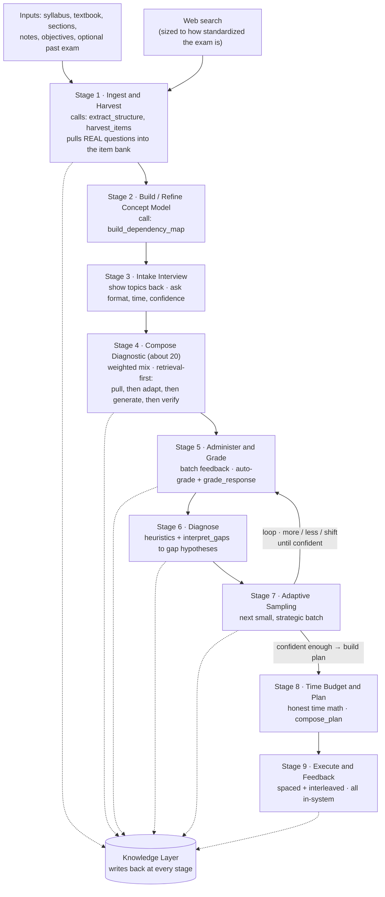
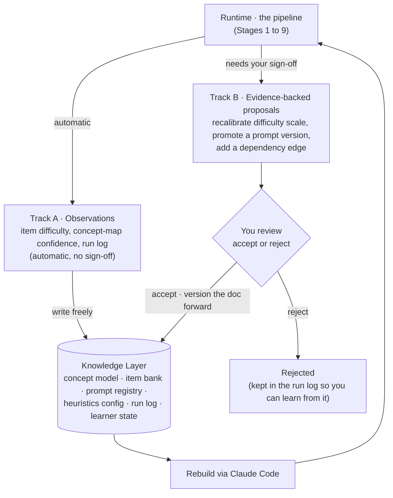

# Adaptive Study System: Flowcharts (v1)

*Diagrams as code, in Mermaid, to match the plain-text, version-controlled philosophy of the knowledge layer. Renders in GitHub, VS Code, Claude Code, or any Mermaid-aware viewer. The detailed narrative for each stage lives in the spec; these are the visual skeleton.*

## 1. The pipeline (Stages 1 to 9)

Solid arrows are the main flow. Dotted arrows are writes back to the knowledge layer. The arrow from Stage 7 back to Stage 5 is the adaptive cycle, carrying your more / less / shift control, and it runs until the system is confident before it moves on to the plan.

## 2. The knowledge-layer feedback loop

This is the self-improvement design. Track A is observations, which write to the knowledge layer automatically because they are facts, not design changes. Track B is changes to the foundational docs, which only land after you accept them. The arrow at the bottom closes the loop: the docs rebuild the runtime through Claude Code, which is why the app is disposable and the knowledge layer is the product.

## 3. How to read the two together

The first diagram is what the system does for a single study session, start to finish. The second is what the system does to itself over many sessions. The link between them is the dotted writeback arrows in diagram one, which are exactly the inputs that feed Track A and Track B in diagram two. Run the pipeline, it sharpens the knowledge layer, the knowledge layer makes the next run smarter, and once in a while it asks your permission to change how it fundamentally works.

## 4. Next step

The todo list and build plan for Claude Code: the order to build the pieces in, what to stub first, and how to sequence it so you have a working personal version early and layer the harder calibration in later.
